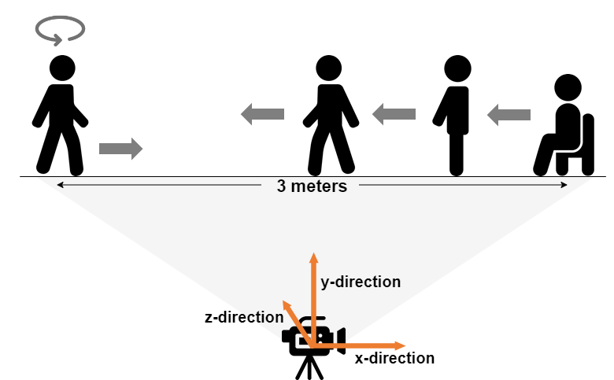

# An Explainable Alzheimer's Disease Detection through Human Behavior Video Analysis

## Abstract
Alzheimer's disease (AD) is a progressive neurodegenerative disease characterized by cognitive and functional symptoms such as memory loss and balance problems. Current diagnostic methods, such as brain imaging and cognitive impairment questionnaires, are costly and time-consuming, making early detection challenging. In this work, we develop a computer vision-based method to detect AD using behavioral data collected from the Timed Up and Go (TUG) test and the Cookie Theft (CT) picture description task. y analyzing body joints and facial landmarks through 2D Convolutional Neural Networks (2D CNN) and Support Vector Machines (SVM), we classified subjects into AD and Non-AD categories across four subtasks: Walking, Sit-Stand, Turning, and Describing. Our approach achieved an F1-score of 0.90, demonstrating the potential of video-based analysis for AD detection. To enhance the reliability of our predictions, we apply model explanation methods, Gradient-weighted Class Attention Map (Grad-CAM) and SHapley Additive Explanation (SHAP) to identify key features and symptoms in the model's decision-making process.

## Dataset
### Subjects

### Experimental Setup
1. Timed Up and Go (TUG) trial.

2. Cookie Theft picture description trial.

## Methodology
### Data Pre-processing
1. Body Landmarks Detection: YOLOv7 Pose Estimation

2. Facial Landmarks Detection: MediaPipe Face Mesh Detection

### Modeling Overview

## Results
### Performance Evaluation
Evaluation results of ACC (Accuracy), SEN (Sensitivity), SPE (Specificity), PRE (Precision), and F1-score. 
The values in bold represent the best performance for each evaluation metric, while the underlined values indicate the second-best performance.

### Model Interpretation and Visualization

#### Walking Posture and Track
Model interpretation results on a figure of distance changes in the x-direction between the left and right ankles during walking with Gradient-weighted Class Activation Mapping (Grad-CAM) method. Non-AD subjects walk faster and have longer stride lengths, while AD patients have slower walking paces and shorter stride lengths. In addition, the
distance difference of each step taken by AD patients is relatively unstable and marked with darker red dots, thus showing the abnormal characteristics of AD patients’ gait.

#### Head Movement

#### Turuning Period Importance